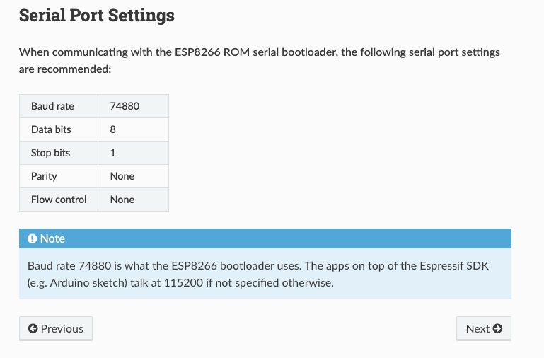

# 0-hello-world

The idea was to create a program that simply puts "Hello world!" thorugh the serial monitor. With this we are more familiar with PlatformIO and the project.

## Concepts learned

### Baud rate

It has to be set to 115200 so you can see `Serial.println` messages in the serial monitor.

Reference: https://docs.espressif.com/projects/esptool/en/latest/esp8266/esptool/serial-connection.html
